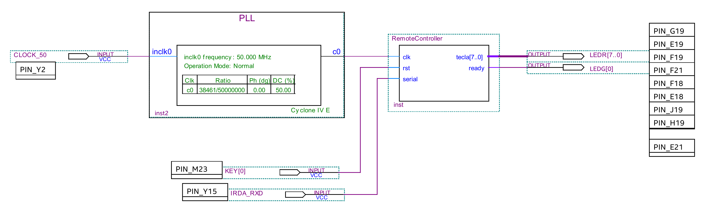
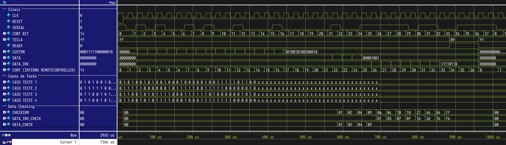
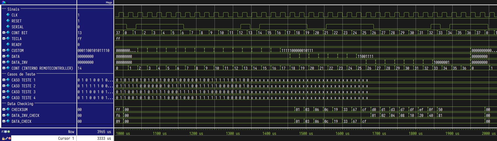
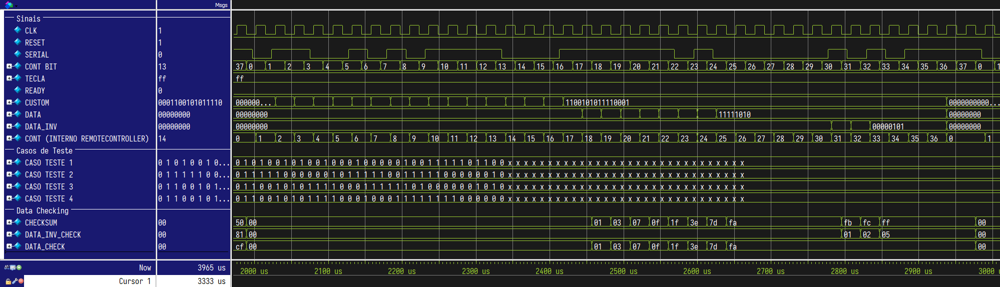
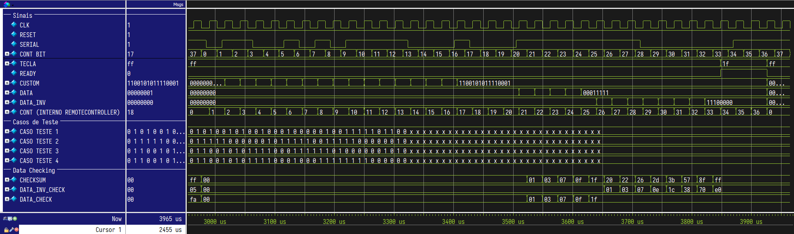
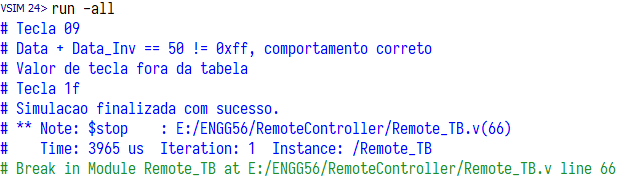

# RemoteController

***Links***
* [Código do RemoteController](../RemoteController/RemoteController.v)
* [Testbench do RemoteController](../RemoteController/Remote_TB.v)

## Implementação

Basicamente o programa foi implementado como uma sequência de contagem para detectar 34 bits e esperar 3 bits para propagação do sinal da tecla na saída do módulo, ou seja, foi implementado um contador que conta de 0 a 36, e dependendo do valor da contagem é diferenciado se:
* está sendo recebido o bit de inicialização;
* estão sendo recebidos bits do código custom;
* estão sendo recebidos bits de dados;
* estão sendo recebidos bits de dados invertidos;
* está sendo recebido o bit de finalização;
* está sendo propagado o sinal de tecla na saída (caso o valor seja válido).

## Pin Assignments

Após a implementação em Verilog, foi feita a conexão com os pinos físicos do FPGA.

Foi gerado um PLL para criar o sinal de clock de RemoteController a partir do sinal original de clock de 50 MHz, de modo que o sinal de clock de RemoteController tem aproximadamente 38 kHz de frequência (foi configurada uma frequência cujo período é de 26 microssegundos).

O pino de reset foi conectado ao botão 0 da placa (KEY[0]), e sua entrada serial foi conectada ao leitor de infravermelho (IRDA_RXD).

## TimeQuest

Após a primeira análise e síntese e aplicação do Time Analyzer, foi possível observar que a frequência máxima de operação era demasiado alta, o que nos dava uma folga de operação, com certeza.

Com frequências de operação típicas na casa dos MHz, projetamos um circuito para trabalhar com um clock de 38 kHz. No Timing Analyzer aplicamos o clock com período de 26 microssegundos e configuramos o delay de inputs/outputs para 2.6 microssegundos.

## Testbench e resultados

O testbench foi construído para detectar e diagnosticar erros nos dados lidos, bem como diagnosticar ativação/desativação incorreta do sinal de ready.

Foram estruturados 4 casos para teste, de modo que:
* O primeiro caso resulta na leitura da tecla de valor 0x09;
* O segundo caso resulta na leitura de um data e um data_inv que, somados, não resultam em 0xFF, ou seja, erro de leitura;
* O terceiro caso resulta na leitura de um data e um data_inv que, somados, resultam em 0xFF, no entanto o valor não consta na tabela;
* O quarto caso resulta na leitura da tecla de valor 0x1F.

Abaixo podem ser visualizados os waveforms da simulação dos 4 casos, bem como as mensagens de log exibidas pelo testbench no console.

***Caso 1***

***Caso 2***

***Caso 3***

***Caso 4***

***Console***

