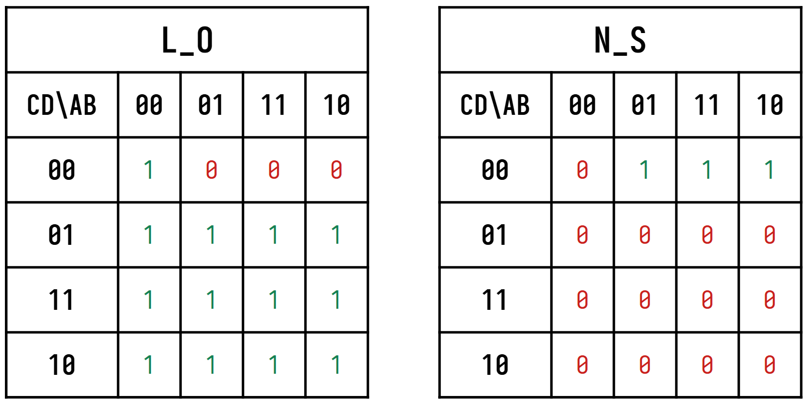
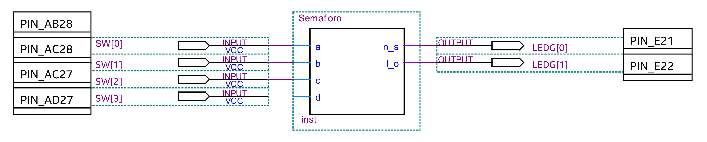
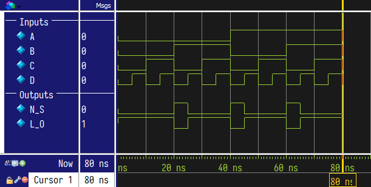
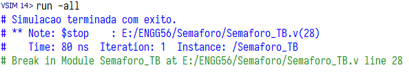

# Semaforo

***Links***
* [Código do Semáforo](../Semaforo/Semaforo.v)
* [Testbench do Semáforo](../Semaforo/Semaforo_TB.v)

## Implementação

Para a implementação do circuito do semáforo, foi utilizada lógica puramente combinacional, com as seguintes equações booleanas representando as saídas:
$$N\_S = (A+B).\overline{C}.\overline{D}$$ $$L\_O = \overline{N\_S}$$

As equações foram extraídas a partir da tabela-verdade e sua projeção no mapa de Veitch-Karnaugh, ambos os quais podem ser visualizados logo abaixo.

***Tabela Verdade***

| A | B | C | D | N_S | L_O |
|:-:|:-:|:-:|:-:|:---:|:---:|
| 0 | 0 | 0 | 0 |  0  |  1  |
| 0 | 0 | 0 | 1 |  0  |  1  |
| 0 | 0 | 1 | 0 |  0  |  1  |
| 0 | 0 | 1 | 1 |  0  |  1  |
| 0 | 1 | 0 | 0 |  1  |  0  |
| 0 | 1 | 0 | 1 |  0  |  1  |
| 0 | 1 | 1 | 0 |  0  |  1  |
| 0 | 1 | 1 | 1 |  0  |  1  |
| 1 | 0 | 0 | 0 |  1  |  0  |
| 1 | 0 | 0 | 1 |  0  |  1  |
| 1 | 0 | 1 | 0 |  0  |  1  |
| 1 | 0 | 1 | 1 |  0  |  1  |
| 1 | 1 | 0 | 0 |  1  |  0  |
| 1 | 1 | 0 | 1 |  0  |  1  |
| 1 | 1 | 1 | 0 |  0  |  1  |
| 1 | 1 | 1 | 1 |  0  |  1  |

***Mapa de Veitch-Karnaugh***

## Pin Assignments

Após a codificação do módulo foram efetuados os pin assignments (ou seja, conexão das entradas e saídas do módulo com pinos físicos do FPGA). 

## TimeQuest

Como o circuito do semáforo é puramente combinacional, não foi necessário fazer Time Analysis nem definição de time constraints.

## Testbench e resultados

O testbench do semáforo foi escrito apenas para testar todas as 16 combinações de entrada possíveis e averiguar se a lógica do circuito estava certa, ou seja, analisar as saídas e comparar com o resultado esperado. 

Na execução, o código desenvolvido passou no teste. Abaixo seguem imagens da forma de onda da execução resultante do testbench, bem como as mensagens de log impressas no console.

***Waveform da execução do testbench***

***Mensagens da execução do testbench***

